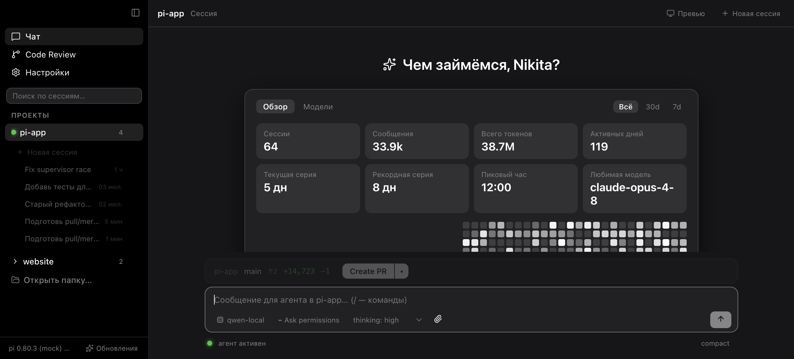

# Pi — Native macOS Client for [pi.dev](https://pi.dev)

> **🌐 Language:** **English** | [Русский](README.ru.md)

<div align="center">

[](https://www.apple.com/macos/)
[](https://tauri.app)
[](https://react.dev)
[](https://www.typescriptlang.org)
[](LICENSE)

</div>

Lightweight native macOS app for **[pi](https://pi.dev)** — a full-featured AI coding assistant with streaming chats, session management, git integration, marketplace, and configuration management.

## ✨ Features

- **Streaming chats** — real-time token streaming with thinking, tool calls, and markdown rendering
- **Durable background tasks** — top-bar status and controls, heartbeat liveness, idle/eviction protection, and guarded app/session exit for multi-hour work
- **Session management** — workspaces, search, in-session change-and-resend rewind with confirmed workspace rollback, explicit fork, pin, archive, grouped sessions
- **AI session names** — the Recommended profile uses a short thinking-off Pi call to replace raw first-message snippets without overwriting manual names
- **macOS 26/27 icon families** — Liquid Glass, Aurora, and Graphite masters with a live Dock/UI glyph selector that can follow the main appearance preset
- **Full git center** — staging, commits, branches, fetch/pull/push, commit history with diffs
- **Code review** — checkpoints, unified diffs, line comments, file revert
- **Live sessions** — file watcher on `~/.pi/agent/sessions`, new sessions appear instantly
- **Context window control** — ring indicator, tokens/cost details, auto-compaction toggle
- **Permission system** — native extension UI (select/confirm/input/editor), non-blocking
- **Background work** — queued subagents remain visible above the composer with isolated worktree support
- **Adaptive execution workflow** — observable project gates, independent evaluation, bounded repair, and always-on hardened Ponytail policy
- **Agent-native live preview** — the model controls the same sandboxed dev server as the split UI via `live_preview`, waits for HTTP readiness, reads retained logs, and must verify visual work through `agent_browser`/`chrome_*` evidence before workflow gates can pass
- **Memory-efficient** — background history offloaded to files, tool outputs bounded
- **Create PR/MR** — GitHub (`gh`), GitLab (`glab`), or browser-based
- **Self-update** — check latest version on GitHub, rebuild from source, relaunch
- **Analytics** — per-day cost, per-model stats, hourly usage charts

## 📸 Screenshots

### Main Chat View



### Settings View

Configure editor, process limits, idle-kill, theme, UI scale, extensions, skills, MCP servers, and models.

### Review View

Git review with checkpoints, unified diffs, line comments, and file revert.

### Marketplace

Browse and install community extensions and skills from the npm registry.

## 🚀 Getting Started

### Requirements

| Requirement | Version |
| --- | --- |
| macOS | 13+ |
| [pi](https://pi.dev) | ≥ 0.80 (in `$PATH`) |
| [Node.js](https://nodejs.org) | ≥ 20 (for development) |
| [Rust](https://rustup.rs) | stable (for building) |
| [Git](https://git-scm.com) | ≥ 2.39 |

### One-command install

Clone, build, and drop the app into `/Applications` in a single step:

```bash
git clone https://github.com/NickLitwinow/pi-app.git && cd pi-app && npm run bootstrap
```

The app is unsigned — on first launch, right-click `Pi.app` → **Open**. Install
[pi](https://pi.dev) so agent sessions work.

### Develop

```bash
npm ci               # `npm install` rewrites the tracked package-lock.json
npm run dev          # UI only, mock backend, no pi needed — http://localhost:1420
npm run tauri dev    # full app with hot-reload (requires pi installed)
```

### Build for distribution

```bash
npm run tauri build  # .app + .dmg under src-tauri/target/release/bundle/
```

### In-app update fails with "local changes would be overwritten"

```
error: Your local changes to the following files would be overwritten by merge:
        package-lock.json
```

Versions up to `6a1dae4` ran `npm install` during the update, which rewrote the
tracked `package-lock.json` and left the checkout dirty — so the *next* update
aborted at `git pull --ff-only`. Newer versions use `npm ci` and reset build
artifacts automatically, but you need one manual step to get there:

```bash
cd /path/to/pi-app          # your sources checkout (Update Center shows the path)
git checkout -- package-lock.json src-tauri/Cargo.lock
```

Then run the update again. Your own uncommitted work is never touched by this —
the updater now refuses to start when it finds any, and lists the files instead.

## ⌨️ Keyboard Shortcuts

| Shortcut | Action |
| --- | --- |
| `⌘B` | Toggle sidebar |
| `⌘N` | New session (in current project) |
| `⌘1` | Open Chat view |
| `⌘2` | Open Review view |
| `⌘3` | Toggle split-screen (chat + preview) |
| `⌘4` | Open Settings view |
| `⌘0` | Reset UI scale |
| `⌘+` / `⌘-` | Increase / Decrease UI scale |
| `⌘,` | Open Settings |

## 🏗 Architecture

Pi is a Tauri 2 application with a React 19 frontend. The Rust backend runs `pi --mode rpc` (JSONL over stdio) for each active session and streams events to the WebView.

For frontend work, the Preview pane and harness first read an explicit
`.claude/launch.json`, then fall back to project-native discovery of
`package.json` `dev`/`start`/`serve`/`preview` scripts or a static `index.html`.
The model-facing `live_preview` tool is bridged through the supervisor to the
native preview manager; it never starts a second untracked dev server. `start`
waits for a real HTTP response and follows the actual local URL announced in
server logs, `status` returns recent output, and `stop` is scoped to the current
workspace. Agent-owned previews receive a bounded eight-hour lease so a long
reasoning/build turn is not mistaken for an abandoned UI pane. Visual workflow
steps remain incomplete until a browser tool has both navigated to the returned
URL and inspected the rendered page.

The opt-in `npm run test:preview-model` gate runs the real desktop RPC bridge
against the configured ThinkingCap model, requires it to call both
`live_preview` and `agent_browser`, and verifies evidence from the rendered DOM.

```
┌─────────────────────────────────────────────┐
│  Frontend (React 19 + TypeScript)           │
│  ┌───────────┬───────────┬───────────────┐ │
│  │  Chat     │  Review   │  Settings     │ │
│  │  View     │  View     │  View         │ │
│  └───────────┴───────────┴───────────────┘ │
│  Zustand store  │  Backend abstraction      │
└───────────────┬───────────────────────────┘
                │  invoke / listen
┌───────────────▼───────────────────────────┐
│  Backend (Rust via Tauri)                 │
│  ┌───────────┬───────────┬───────────────┐ │
│  │ supervisor│  jsonl    │  sessions     │ │
│  │ (spawn/  │  (JSONL   │  (scan,       │ │
│  │  kill)   │   RPC)    │   search)     │ │
│  └───────────┴───────────┴───────────────┘ │
│  ┌───────────┬───────────┬───────────────┐ │
│  │  config   │  gitops   │  pi_cli       │ │
│  │ (atomic  │  (check- │  (install,     │ │
│  │  write)   │   points)│   stream)     │ │
│  └───────────┴───────────┴───────────────┘ │
└───────────────┬───────────────────────────┘
                │  JSONL
┌───────────────▼───────────────────────────┐
│  pi (installed agent)                     │
│  --mode rpc → JSONL over stdio            │
└─────────────────────────────────────────────┘
```

## 📁 Project Structure

```
src-tauri/src/
  supervisor.rs   # spawn/kill pi --mode rpc, events, limits, idle-reaper
  jsonl.rs        # strict LF-only JSONL-framer (pi RPC spec)
  sessions.rs     # scan ~/.pi/agent/sessions, metadata, search, analytics
  config.rs       # settings/models/mcp.json: atomic write + backup; skills
  gitops.rs       # checkpoints, review-diff (+untracked), revert
  pi_cli.rs       # pi install/remove/update with output streaming
  editor.rs       # open files in external editor

src/
  lib/            # backend abstraction (Tauri/mock), RPC reducer, markdown, diff
  state/store.ts  # zustand: workspaces, agents, RPC correlation
  components/     # Chat, History, Review, Analytics, Settings, Extension UI
```

## 🔧 Development

### Run Tests

```bash
# Frontend (Vitest)
npm run test

# Rust core (JSONL, sessions, config, git)
cd src-tauri && cargo test
```

### Without Tauri

Run the frontend in a browser with a mock backend — useful for UI-only development:

```bash
npm run dev
```

The mock backend simulates sessions, tool calls, permissions, and analytics.

## 📦 Tech Stack

| Layer | Technology |
| --- | --- |
| Framework | [Tauri 2](https://tauri.app) |
| Frontend | [React 19](https://react.dev) + [TypeScript 5.8](https://www.typescriptlang.org) |
| Styling | CSS (dark/light themes, native macOS look) |
| State | [Zustand 5](https://zustand.pm) |
| Markdown | [shiki 3](https://shiki.style) + [marked 15](https://github.com/markedjs/marked) |
| Icons | [Lucide React](https://lucide.dev) |
| Security | [DOMPurify 3](https://github.com/cure53/DOMPurify) |

## 🗺 Roadmap

Development is planned and tracked in **[docs/ROADMAP.md](docs/ROADMAP.md)** — a detailed,
iteration-by-iteration plan (harness, memory/performance, ecosystem, design system).
The implemented workflow contract and evidence-backed residual gaps are documented in
**[Harness v3](docs/HARNESS-REDESIGN-2026-07-18.md)** and the
**[Russian gap audit](docs/HARNESS-GAP-AUDIT-RU-2026-07-18.md)**.
Open items are filed as [issues](https://github.com/NickLitwinow/pi-app/issues).

## 🤝 Contributing

Contributions are welcome — see **[CONTRIBUTING.md](CONTRIBUTING.md)** for dev setup, the
repository map, how to run the tests, and the PR checklist. Good starting points are issues
labeled [`good first issue`](https://github.com/NickLitwinow/pi-app/labels/good%20first%20issue);
open-ended questions go in [Discussions](https://github.com/NickLitwinow/pi-app/discussions).

## 🙏 Acknowledgements

Built on top of the open [pi](https://pi.dev) coding agent and its community ecosystem of
extensions, skills, and themes.

## 📄 License

MIT © [NickLitwinow](https://github.com/NickLitwinow)

---

*Built with ❤️ by [NickLitwinow](https://github.com/NickLitwinow)*
