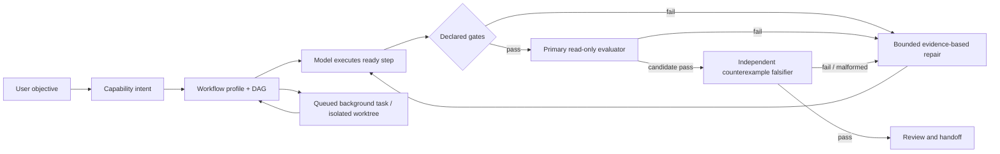
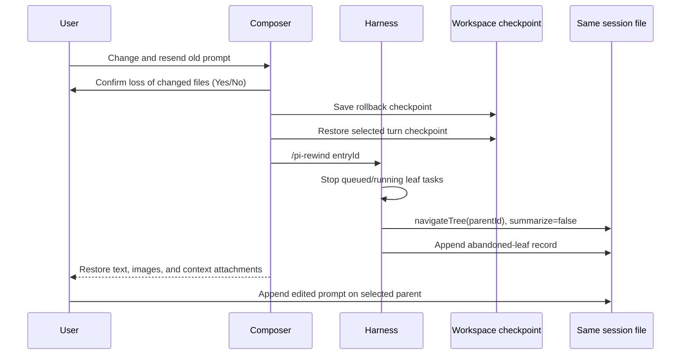

# Harness v3: workflows, sessions, and evaluation

This is the implemented runtime contract for
`ThinkingCap-Qwen3.6-27B-oQ4e-M4Q-DWQ-MTP-Vision`. The model is an executor inside an
observable workflow; it is not asked to simulate every orchestration role in prose.

## Design rules

- Route by independent capabilities, not a single keyword category. A request can
  require mutation, research, planning, a sandbox, evaluation, and approval at once.
- Keep the model flexible inside a step, but keep workflow state, dependencies,
  verifier execution, retry budgets, and approval deterministic.
- Grade the repository state and observed command results. A confident final answer
  is not evidence.
- Persist state as typed session entries so resume, compaction, rewind, and the UI use
  the same source of truth.
- On one local GPU, queue model work. Do not pretend that simultaneous inference is
  useful parallelism.

The implementation is split between `harness-extension/policy.ts`,
`harness-extension/workflow.ts`, `harness-extension/workspace.ts`, and
`harness-extension/index.ts`. Policy, workflow construction, and workspace
fingerprinting are pure/testable modules; the extension owns Pi lifecycle integration.

## Capability intent and profiles

`inferTaskIntent()` returns these axes independently:

- primary route: trivial, assessment, research, debug, or build;
- profile: feature, bug, chore, hotfix, research, or assessment;
- mutation permission, research need, plan need, sandbox need, evaluator need,
  human-approval need, and risk;
- the signals that produced the decision.

An explicit build request cannot be downgraded to read-only because the prompt also
says “research” or “audit”. A config migration with a defect routes to the bug profile;
a short rename remains a mutating chore. High-risk/hotfix work waits for explicit plan
approval.

Each profile expands to a persisted DAG. Examples:

- feature: plan -> build -> gates -> evaluator -> review;
- bug: reproduce -> fix root cause -> regression gates -> evaluator -> review;
- hotfix: containment plan -> human approval -> minimal fix -> safety gates ->
  evaluator -> ship review;
- research/assessment: evidence collection -> evidence review, without write steps.

Every node has dependencies, observable acceptance, status, attempts, timestamps,
and evidence. Project-specific gates come from `.pi/verifiers.json` or
`.pi/workflow.json`; otherwise conventional package scripts are detected. The current
repository tracks five required project gates: frontend tests, production build,
Playwright visual regression, Rust tests, and Rust formatting.

## Execution, gates, and loops

The harness injects only a concise profile-specific contract. It does not create LLM
roles for lint, format, test, or build. After edits, it executes every declared verifier
programmatically and records the real exit/result. Non-zero exits, failed suites, or
masked exits cannot become a green gate.

Failed gates reopen the executor with the new evidence. Automatic repair is bounded
to four continuations by default (`PI_APP_HARNESS_MAX_LOOPS`, hard capped at four).
Each repair must rerun the complete clause/corpus audit because a semantic evaluator
can expose only the first surviving blocker; the quoted clause is not a stopping point.
Repeated or malformed tool calls receive one strategy correction; tools are not
blocked by a second hidden permission system. Exhausted repair is a visible failure,
not an invented success.

High-risk profiles are the exception: their persisted human-approval node is a real
gate. Write, shell, and delegated-agent calls are blocked until the user approves the
plan in the UI. This is a capability boundary derived from intent, not a keyword
denylist applied to ordinary work.

After deterministic gates pass, the harness launches a separate `pi` process with the
same model and only `read,grep,find,ls`. Extensions, skills, context files, and session
persistence are disabled for that process. It receives the original objective, actual
`git diff`, and gate evidence, and must end with an exact `VERDICT: PASS` or
`VERDICT: FAIL`. A candidate PASS launches a second clean process whose only job is to
falsify it with counterexamples. Completion requires PASS from both phases; a failed,
timed-out, or malformed falsifier is a failed semantic gate. The combined record stores
protocol version 2 and completed-quorum evidence. Same-session recovery refuses legacy
single-review records and failed quorums even if their primary section contains PASS.
A failed verdict reopens the bounded repair loop. Each evaluator phase has a default
15-minute timeout because observed high-reasoning ThinkingCap reviews take roughly
7–11 minutes; `PI_APP_HARNESS_EVALUATOR_TIMEOUT_MS` can override it. A triggered repair
turn may run for 30 minutes by default (`PI_APP_HARNESS_REPAIR_TIMEOUT_MS`) before the
outer print-mode process declares it interrupted.

Acceptance is fail-closed but presentation-tolerant: Markdown headings/emphasis are
removed only around protocol control lines, while a PASS still requires a completed
clause matrix, at least one clause PASS, no clause FAIL, `BLOCKING: NONE`, and a final
PASS verdict. The evaluator traces an explicit coercion corpus for scalar parsers and
a separate type-strict corpus for version/state/kind discriminators. Stateful
undo/redo, rewind/return, and checkpoint/restore contracts additionally require an
identity-plus-payload round trip, invalid-handle probes, same-session invariants, and
nested-alias checks; restoring data under the wrong active identity is blocking. A programmatic
preflight rejects deleted tracked files unless deletion was explicitly authorized.
If a model claims PASS without the accepted control protocol, its positive prose is
discarded rather than quoted back to the builder: otherwise the executor anchors on
“all clauses pass” and performs no repair. The continuation instead receives a fresh
adversarial audit instruction; genuine FAIL evidence remains attached.

Pi's extension `sendMessage(..., triggerTurn:true)` is fire-and-forget. The harness
therefore keeps the outer `agent_settled` handler pending until the nested repair turn
actually starts and settles; after every repair it re-runs deterministic gates and the
evaluator. This lifecycle was verified with two real evaluator invocations and a real
nested model turn in one print-mode process.

Both evaluator phases are intentionally separate processes rather than background subagents:
headless subagent lifecycle experiments returned verdict text but kept the parent Pi
process alive. The isolated process has a finite timeout and demonstrated clean exit.

## Background tasks and sandboxes

`@tintinweb/pi-subagents` remains the user-facing task engine: queue, run, steer,
cancel, inspect transcript/diff, retry, and merge. These controls are direct operations,
not hidden prompts to the parent model: steer targets the live child session, transcript
reads retained output, and diff is calculated from the recorded base SHA and branch.
Retry reuses the original prompt. Writing agents should use isolated worktrees;
read-only exploration can use an isolated session. The local ThinkingCap profile uses
`maxConcurrent: 2`: two independent worktree agents start concurrently, while further
jobs remain queued. This keeps the machine responsive without reducing “background” to
sequential execution. Final verification rejects any configuration below two and the
advanced benchmark proves that both execution intervals overlap.

The harness persists the last 50 lifecycle records instead of erasing completed jobs.
`subagents:created`, `started`, `completed`, and `failed` are bridged into RPC-safe JSON
widgets. The app restores these records after resume and exposes live controls in the
Tasks tab. A restored queued/running record without a live process is marked
interrupted instead of poisoning rewind forever.

Merge is a transaction. It requires explicit UI confirmation, a completed isolated
branch, and a clean parent. The harness creates a detached integration worktree, merges
there, runs every required verifier from the candidate manifest, creates a merge commit,
checks the parent is still clean, and only then fast-forwards it. Conflicts or gate
failure discard the integration worktree and leave the parent untouched.

On macOS, new app agents default to an OS-enforced `workspace-write` sandbox. Reads are
available for repository discovery; writes are limited to the active workspace, Pi
session/runtime locks, MCP/Ponytail runtime state, and OS scratch inherited by child
processes. `Unrestricted` is an explicit Settings choice for exceptional workflows.

## Session state and compaction

The append-only Pi session contains typed entries for:

- workflow DAG and timeline;
- background-task lifecycle and evaluator records;
- structured context checkpoints and compaction summaries;
- rewind/abandoned-leaf and branch-return records.

At 75% context usage, the harness persists a structured checkpoint containing the
objective, ready/completed steps, decisions, changed files, gate evidence, risks, next
action, and exact token usage. It also asks the executor to finish the current atomic
step rather than opening another workstream. The trigger re-arms after Pi compaction.

Pi core still owns structured compaction. With `contextWindow=262144`,
`reserveTokens=32768`, and `keepRecentTokens=24000`, automatic compaction begins near
229,376 tokens. The UI shows both checkpoint and compaction history. Resume restores
workflow state from typed entries instead of reconstructing it from assistant prose.

## Same-session rewind

Rewind is an atomic branch navigation inside the existing JSONL session:

No second task/session is created, and there is no fallback to fork. The append-only
file retains the abandoned leaf for the Branches inspector and explicit return. By
default rewind also restores the Git checkpoint captured immediately before the
selected user turn. When the current checkpointed tree differs, the preview explicitly
warns that uncommitted changes will be lost and requires Yes/No confirmation. A safety
checkpoint restores the pre-rewind files if session navigation fails. Old session turns
without a file checkpoint fall back visibly to conversation-only rewind. The preview
also lists later turns, attachments, and active tasks. The branch record retains the
abandoned entry count and prompt previews, so the Branches inspector remains useful
after resume.

## UI/UX contract

The control center above the composer has five evidence-backed views:

- Tasks: queued/running/completed/failed state plus cancel, steer, transcript, diff,
  retry, gated merge, tokens, duration, branch, and merged commit;
- Plan: objective, capability/risk routing, DAG dependencies, acceptance, status,
  explicit approval, and the latest persisted model-generated `todo` backlog with
  dependency/owner state. Planning and execution therefore share the session source
  of truth instead of creating a second UI-only checklist;
- Workflow: verifier commands, attempts, evidence, timeline, and retry-gates action;
- Context: measured usage, structured checkpoints, compaction history, risks, and next
  action;
- Branches: rewind leaves and in-session return.

Raw special-widget JSON never leaks into chat. Hidden repair messages do not masquerade
as user turns. Optimistic user messages are replaced by authoritative messages without
dropping image blocks. A failed gate or evaluator remains visibly failed even if the
assistant's prose claims completion.

An evaluator task is explicitly marked `read-only · tied to current run`, shows a
live elapsed timer, and does not expose fake worker-only Cancel/Steer/Retry controls.
Stopping the current run remains the cancellation boundary for this synchronous
semantic gate.

## Ponytail and workflow guidance

The official `git:github.com/DietrichGebert/ponytail` package is globally enabled with
`defaultMode=full`; its Pi extension injects the real upstream instructions before
every coding turn and its skills remain discoverable. The harness adds only a concise
mandatory fail-safe contract, so the operating constraints survive a missing command
state. Runtime smoke tests require both extension commands (`/ponytail`, review, audit)
and skill aliases. Benchmark ablation can still set the mode to `off`; hard binding in
normal use is not allowed to invalidate the experiment.

The Fable experiment was retired by product decision on 2026-07-19. Its five-pair
diagnostic did not improve end-to-end success (1/5 in both arms) and added about 42%
mean latency. No Fable skill, prompt flag, treatment arm, checkout, provenance pin, or
final-verifier dependency remains. General ideas that are independently useful—explicit
done state, evidence before completion, small coherent changes, and observed
verification—are native workflow rules owned and tested by this harness.

Ponytail is pinned at `16f29800fd2681bdf24f3eb4ccffe38be3baec6b`. Its upstream
agentic result is Haiku 4.5, twelve feature tickets, four runs, and explicitly warns
that terse reasoning models can spend more thinking tokens on the decision ladder.
Those claims are priors for the experiment, not evidence about ThinkingCap.

For controlled experiments, `PI_APP_HARNESS_ABLATIONS` independently removes
`classifier`, `repair-loop`, `semantic-gates`, or `ponytail`. Baseline keeps
session/task commands but disables workflow orchestration.

## Evaluation protocol

`bench/run.mjs` creates a fresh committed temporary repository for every trial. Each
trial has its own `PI_CODING_AGENT_DIR`, copied model/auth/AGENTS inputs, session store,
and TMP. Global skills are disabled; harness, Ponytail, and subagents are explicit
fixed paths, while the arm controls their modes and tested skill. macOS denies every
write outside the fixture and separately denies writes to the staged skill. Arms are
interleaved/rotated, not run as one temporal block. The report records model, task,
benchmark and harness hashes, the exact Ponytail revision, Pi/extensions/config
versions, server model catalog, system load, duration, turns, calls, tested-skill
reads, errors, loops, token usage, diff churn, DAG/evaluator state, and
outcome/static/security graders. Skill arms explicitly require one initial load and
the report proves treatment adherence rather than inferring it from CLI arguments.

The long matrix uses at least five trials per arm. A separate model judge sees the
objective, diff, and grader evidence without the implementing extension/skills. Human
review packets are blind to arm and remain `pending-independent-review` until a person
scores them; the benchmark never fabricates human agreement.

The `advanced` suite covers same-session rewind/UI, screenshot-to-workflow vision,
background worktree/merge, compaction continuity, and path/command-injection security.
The rewind case has a separate adversarial contract gate for user-only targets, unknown
handles, session/leaf identity, abandoned-branch return, and nested immutability. This
was added after the executor, primary evaluator, falsifier, and outer model judge all
accepted an implementation that restored messages but left the wrong active `leafId`.
The probe is also a required project-owned `.pi/verifiers.json` node, so its non-zero
exit reopens the persisted repair loop before semantic evaluation; the outer grader
reruns the same script and verifies that the contract/spec files were not modified.
Its background case now requires exactly two non-evaluator Agent calls in one parent
message, overlapping lifetimes, worktree/base-SHA evidence, and proof that both produced
branches are ancestors of the final HEAD. Merely implementing both files in the parent
can no longer pass this scenario.
Component arms provide classifier, repair-loop, semantic-gate, and Ponytail ablations.

Current hard verification evidence:

- 113 frontend/policy unit tests, 61 Rust unit tests plus the real-agent Rust E2E,
  production TypeScript/Vite build, and 22 Playwright visual tests pass;
- runtime exposes all 35 commands, including harness and Ponytail commands;
- rewind RPC smoke reports `sameFile=true`, `noDuplicate=true`;
- direct task-control smoke performs a gated merge in a detached integration worktree,
  passes the candidate verifier, and leaves a clean two-parent merge on the parent;
- macOS sandbox smoke proves protected-repository and nested staged-skill writes fail;
- the isolated-evaluator end-to-end report passes reproduce, build, task gate,
  evaluation, and review with no tool errors or repeated calls.
- strict-discriminator regression replay rejected the known `Number(version)` defect
  in a read-only target sandbox (`VERDICT: FAIL`, 435.93 s), after the earlier generic
  evaluator had falsely accepted it.
- the current source fingerprint passes all 14 quick final-verification stages,
  including the release binary, workflow quorum replay, and same-session rewind.

The first full pass after semantic-quorum hardening accepted config migration at 9/9
after one real repair and compacted an isolated 81,489-token session to 41,971 tokens
without changing the source. The following advanced rewind trial exposed the branch-
identity blind spot described above, so that run was stopped before vision and is not
used as final promotion evidence; the strengthened fingerprint must be rerun.

The completed five-pair baseline/full matrix did not prove an outcome lift: both arms
passed 1/5. Full improved mean criterion score from 0.80 to 0.90 and reduced mean diff
churn from 191.8 to 91.2, but increased mean duration from 793.40 s to 1127.34 s and
tool calls from 27.0 to 32.6. Paired results were 1 win, 1 loss, 3 ties. The runner
process died after all ten expensive executor runs and before blind model-judge output
was persisted; recovery preserves actual workspaces/sessions/graders and marks those
judges missing rather than inventing them. Human packets remain pending.

Multi-trial A/B, advanced, and component-ablation reports are written under
`bench/results/`. Do not promote a percentage from a single exploratory run; use the
completed interleaved matrix and retain `pending` human judgments honestly.

The final expensive evidence pipeline is `npm run verify:harness:final`. It verifies
the exact live model catalog and 262144-token Pi configuration, checkpoints every
quick gate, post-fix trial, advanced task, and ablation arm independently, resumes
after interruption, and produces
`bench/results/final-verification-report.json`. A source/config fingerprint prevents
stale passed stages from being reused after implementation changes. Human packets are
listed as pending rather than converted into a synthetic automated verdict.

## Research basis

The screenshots and [Agentic Engineering video](https://youtu.be/VQy50fuxI34) are an
orchestration reference, not a requirement to turn every diagram diamond into another
model call. Its useful thesis is that loops are one component inside developer workflows
and that a factory router should select the workflow for the task; capability intent plus
profile DAGs implement that idea without pretending every workflow node needs an LLM.
The design also follows the workflow/agent distinction in
[Building effective agents](https://www.anthropic.com/engineering/building-effective-agents),
[long-running harness guidance](https://www.anthropic.com/engineering/effective-harnesses-for-long-running-agents),
[2026 generator/evaluator harness findings](https://www.anthropic.com/engineering/harness-design-long-running-apps),
[context engineering guidance](https://www.anthropic.com/engineering/effective-context-engineering-for-ai-agents),
[agent evaluation guidance](https://www.anthropic.com/engineering/demystifying-evals-for-ai-agents),
Pi's [native compaction contract](https://github.com/badlogic/pi-mono/blob/main/packages/coding-agent/docs/compaction.md). The
session/harness/sandbox separation also follows
[Scaling Managed Agents](https://www.anthropic.com/engineering/managed-agents), while
the 2026 harness findings reinforce removing one component at a time instead of
treating a large prompt stack as permanent.
